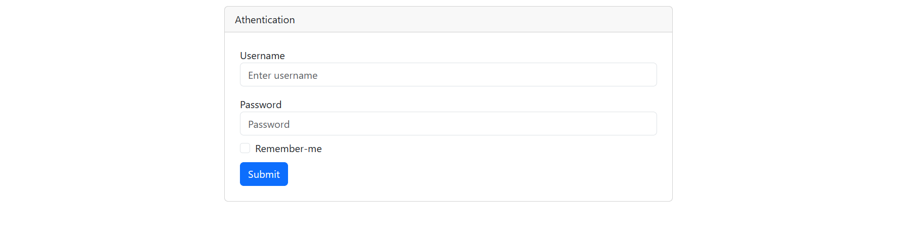
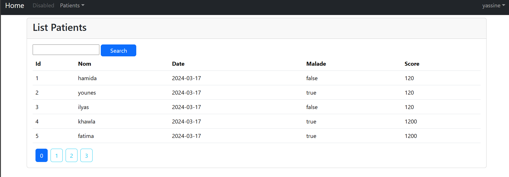
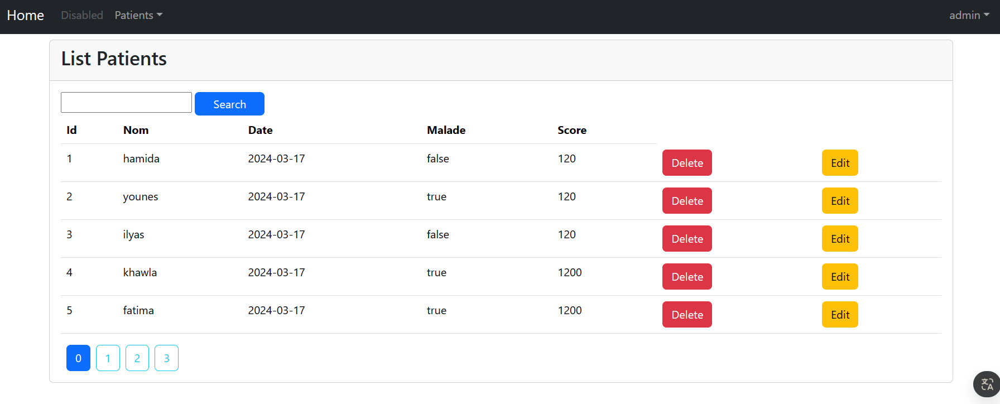
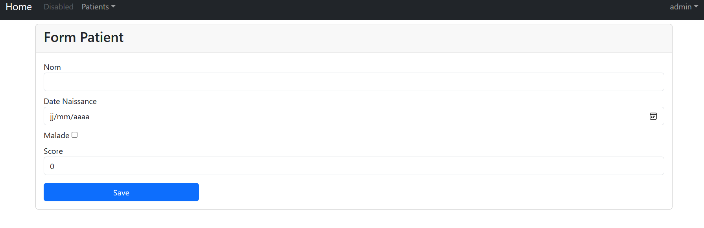

# Gestion des patients

## Description

C'est une application Spring Boot qui gère les données des patients. Elle offre des fonctionnalités pour créer, lire, mettre à jour et supprimer des dossiers de patients. L'application comprend également des fonctionnalités d'authentification et d'autorisation des utilisateurs.
## Fonctionnalités

- Authentification des utilisateurs : L'application dispose d'un système de connexion sécurisé. Les utilisateurs peuvent se voir attribuer différents rôles qui déterminent leur niveau d'accès au sein de l'application.

- Gestion des patients : Les utilisateurs peuvent créer de nouveaux dossiers de patients, consulter ceux existants, mettre à jour les informations des patients et supprimer des dossiers.

- Gestion des utilisateurs : Les utilisateurs ayant le rôle d'administrateur peuvent créer de nouveaux utilisateurs, consulter ceux existants, mettre à jour les informations des utilisateurs et supprimer des comptes.

- Gestion des rôles : Les utilisateurs ayant le rôle d'administrateur peuvent créer de nouveaux rôles, consulter ceux existants, mettre à jour les informations des rôles et supprimer des rôles.

## Installation

1. Clonez le dépôt
2. Naviguez jusqu'au répertoire du projet
3. Exécutez l'application à l'aide de la commande `mvn spring-boot:run`

## Captures d'écran de l'application
-Page d'authentification

-Page d'accueil pour les utilisateurs ayant le rôle Client

-Page d'accueil pour les utilisateurs ayant le rôle Admin

## Technologies utilisées
- Java
- Spring Boot
- SQL
- Maven
- Thymeleaf
- Bootstrap
- Spring Security
- Spring Data JPA

## Auteur
Yassin MK -
[GitHub](Github.com/Yassinmk)

